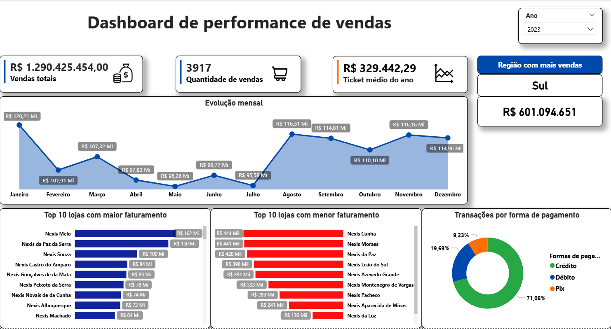
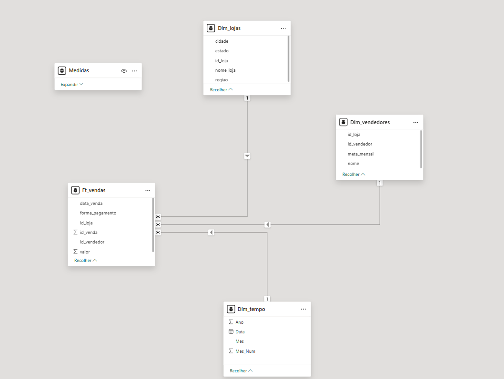

# 📊 Dashboard de Performance de Vendas (Sales Performance Dashboard)

Este projeto apresenta um dashboard desenvolvido com **Power BI** e suporte de **Python** para geração de dados, com foco na análise de desempenho de vendas e apoio à tomada de decisão.

---

## 🎯 Objetivo

O objetivo deste projeto é simular um cenário de vendas e transformar dados em insights estratégicos, permitindo:

- Analisar o faturamento total
- Avaliar o ticket médio
- Acompanhar a evolução das vendas ao longo do tempo
- Identificar os melhores vendedores e lojas
- Entender a distribuição por formas de pagamento

---

## 🛠️ Ferramentas Utilizadas

- Power BI  
- DAX  
- Python (Pandas, Faker)  
- Excel  

---

## 🧠 Modelagem de Dados

O projeto foi estruturado utilizando **modelagem dimensional (modelo estrela)**, garantindo organização e escalabilidade nas análises.

- **Fato:**
  - `F_vendas`

- **Dimensões:**
  - `Dim_vendedores`
  - `Dim_lojas`
  - `Dim_tempo`

Essa estrutura permite análises por diferentes perspectivas, como vendedor, loja e período.

---

## 📊 Funcionalidades do Dashboard

- Indicadores principais (KPIs):
  - Faturamento total  
  - Ticket médio  
  - Quantidade de vendas  

- Análises visuais:
  - Evolução mensal de vendas  
  - Ranking de vendedores  
  - Ranking de lojas  
  - Distribuição por forma de pagamento  

- Filtros interativos para exploração dos dados  

---

## 📸 Preview do Dashboard

### 📊 Visão Geral

### 🧠 Modelagem de Dados

---

## 📂 Estrutura do Projeto

- `dashboard/dashboard.pbix` → Arquivo do Power BI  
- `data/dataset.csv` → Base de dados (simulada)  
- `scripts/data_generation.py` → Script de geração de dados  
- `images/` → Imagens do dashboard  

---

## 💡 Sobre o Projeto

Este projeto foi desenvolvido como parte do meu portfólio em **Análise de Dados e BI**, com o objetivo de demonstrar habilidades em:

- Geração de dados com Python  
- Modelagem dimensional  
- Construção de dashboards no Power BI  
- Análise de indicadores de negócio

